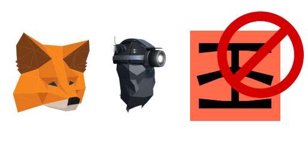

# How to plug an Ethereum "light client" to Metamask 📡

How to setup a local Ethereum 1.0 light client using Geth and how to connect it to Metamask.

This main benefit is to not **fully** rely on third-party infrastructure (i.e Infura) to submit transactions the Ethereum mempool - your light client is actually getting data from full nodes so a full node might be an even better option if you can spare the cash for a 2TB+ SSD (port-merge) - this helps data availability within the network.

Use it at your own risk. Always DYOR regarding distributed systems and crypto.

An update will be released for Ethereum Proof-of-stake post Merge.

#### Install Geth

Get the latest Geth from https://geth.ethereum.org/downloads/ and unpack it.
    
#### Run it !

Through a terminal

    ./geth --datadir /Users/myu/code/geth_data --syncmode "light" --http --http.port 8545 --http.api personal,web3,eth,net --http.corsdomain '*'

You can of course replace the `--datadir` argument by the location of your choice, currently the light client takes < 500 MB of space.

Let the sync proceed, with the light client it's pretty fast (around 15 mins) - you can see if it's syncing if you only have "Imported new block headers" messages on the logs.

#### Metamask Setup

Open Metamask, click on the Network drop down which is at the very top, select "Localhost 8545"

You can then try to send a Tx through it to see if it works ! If you are fast enough, you'll see that your Geth client received a transaction in its logs.

That's all folks, happy setup ! :)

#### Software versions

    Geth 1.10.18
    Metamask 10.x

See also : https://ethereum.org/en/developers/tutorials/run-light-node-geth/
