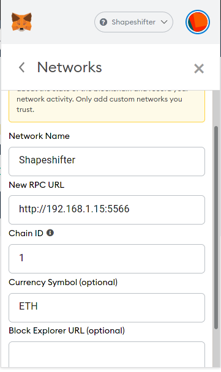

# eth1_light_client_to_metamask

This tutorial is intend to explain how to setup a local ETH1 light client using Geth and how to submit an Ethereum Tx to the mempool through it.

This has the benefit that you do not rely on third-party infrastructure (i.e Infura) to access the Ethereum mempool.

PR welcomed and no warranty, use it as your own risk. Always DYOR.

#### Install Geth on Linux

Get the latest Geth from https://geth.ethereum.org/downloads/ , here we are using 1.9.25

    tar xzvf geth-linux-amd64-1.9.25-e7872729.tar.gz
    cd geth-linux-amd64-1.9.25-e7872729.tar.gz
    
#### Run it !

    ./geth --data-dir /mnt/eth_chain --syncmode "light" --http --http.port 5566 --http.api personal,web3,eth,net --http.corsdomain '*' --rpc --rpcaddr <REPLACE_BY_YOUR_LOCAL_IP>

For this tutorial, I have used 192.168.1.15 as local IP, I will use this value later on.

Let the blockchain sync, with the Light client, it's pretty fast, around 15 mins, you can see if it's synced if you only have "Imported new block headers" messages.

#### Metamask Setup

Open Metamask and on the Network drop down which is at the very top, select "Custom RPC"

Set those values :

**Network Name** : pick_whatever_you_want

**New RPC URL** : http://REPLACE_BY_YOUR_LOCAL_IP:HTTP_PORT (e.g here : 192.168.1.15:5566)

**Chain ID** : 1

If all goes well, Metamask will allow it !

You can then try to send a Tx through it to see if it works ! If you are fast enough, you'll see that your Geth client received a transaction in its logs.

That's all folks, happy setup ! :)
