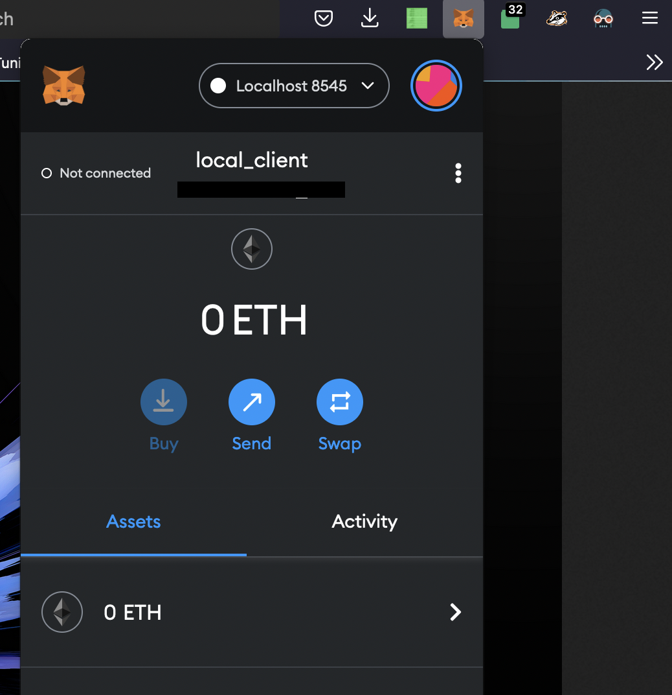

# How to submit an Ethereum Tx through Metamask via Geth "light client"

This tutorial is intended to explain how to setup a local ETH1 light client using Geth and how to submit an Ethereum Tx to the mempool through it.

This has the benefit that you do not **fully**rely on third-party infrastructure (i.e Infura) to access the Ethereum mempool but your Light node is getting data from full nodes so a full node might be an even better option if you can spare the cash for a 1TB+ SSD.

PR welcomed and no warranty, use it at your own risk. Always DYOR.

#### Install Geth on Linux

Get the latest Geth from https://geth.ethereum.org/downloads/ and unpack it.
    
#### Run it !

    ./geth --datadir /Users/myu/code/geth_data --syncmode "light" --http --http.port 8545 --http.api personal,web3,eth,net --http.corsdomain '*'

You can of course replace the --datadir argument by the location of your choice, currently the light client takes < 500 MB of space.

Let the blockchain sync, with the light client it's pretty fast (around 15 mins). You can see if it's synced if you only have "Imported new block headers" messages on the logs.

#### Metamask Setup

Open Metamask, click on the Network drop down which is at the very top, select "Localhost 8545"

You can then try to send a Tx through it to see if it works ! If you are fast enough, you'll see that your Geth client received a transaction in its logs.

That's all folks, happy setup ! :)
